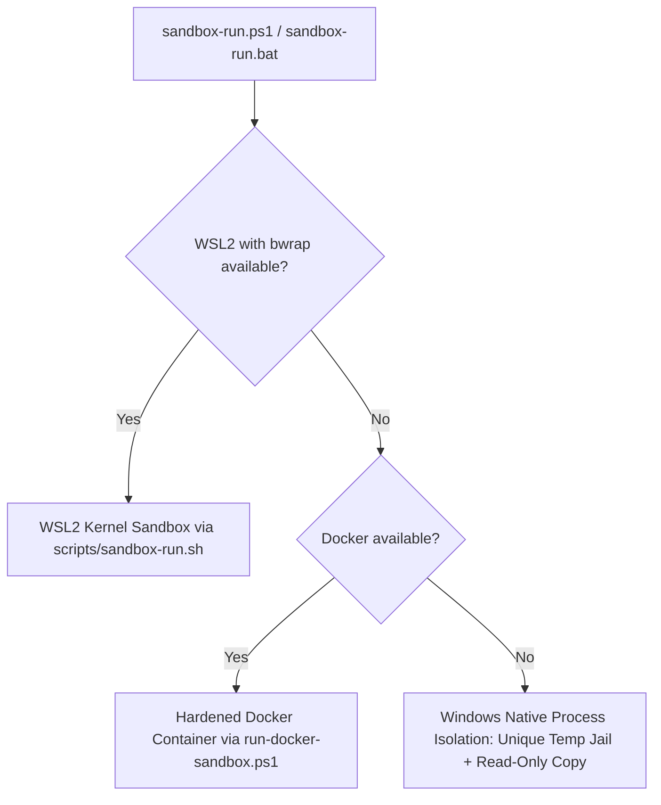

# Sandbox Subsystem (`security.sandbox`)

## Overview

The `security.sandbox` package provides host-level and process-level isolation controls for DocShield CDR. Document processing often requires dealing with malformed, exploit-laden, or legacy binary files that can trigger memory corruption or logic flaws in external parsers (e.g., LibreOffice). The sandbox subsystem guarantees that:
1. File operations cannot escape authorized directory boundaries (Zip Slip, path traversal).
2. XML parsing cannot trigger XML External Entity (XXE) attacks, Billion Laughs expansion bombs, or SSRF.
3. External subprocesses run with strict timeouts, memory/storage limits, network airgaps, and forced process-tree destruction.

---

## Core Classes

### 1. [`SubprocessSandbox`](file:///D:/CAIR/DOC%20SHIELD/DocShield/cdr/src/main/java/security/sandbox/SubprocessSandbox.java)
- **Path**: `src/main/java/security/sandbox/SubprocessSandbox.java`
- **Purpose**: Executes external programs (such as headless LibreOffice for legacy DOC/PPT/XLS conversion) inside a resource-constrained, isolated jail.
- **Key Responsibilities**:
  - **Bubblewrap (bwrap) Integration**: Automatically detects `bwrap` availability via `bwrap --version` (can be explicitly disabled via system property `-Ddocshield.sandbox.bwrap.disable=true`). When available, wraps commands with hardware/namespace isolation:
    - `--unshare-all`: Isolates PID, IPC, UTS, user, and network namespaces (network airgap).
    - `--die-with-parent`: Kills the container immediately if the parent JVM process exits.
    - `--new-session`: Detaches terminal controls.
    - `--ro-bind / /`: Mounts the host root filesystem as read-only.
    - `--proc /proc` & `--dev /dev`: Provides virtual kernel filesystems.
    - `--tmpfs /tmp`: Creates an isolated in-memory temporary filesystem.
    - `--ro-bind-try <inputFile>`: Mounts input document strictly as read-only.
    - `--bind <workspace>`: Restricts file writes exclusively to the designated ephemeral workspace.
  - **Strict Execution Timeouts**: Enforces hard process timeouts (e.g., 60 seconds default). If the subprocess hangs or enters an infinite loop, the entire process tree is forcibly killed.
  - **Periodic Resource Monitoring**: Spawns a dedicated background monitor (`ScheduledExecutorService`) that samples the output workspace directory size every 250 milliseconds. If the generated output exceeds `maxOutputBytes` (e.g., 200 MB), the process is immediately killed to prevent disk exhaustion attacks.
  - **Bounded Output Collection**: Uses a background reader thread with a bounded buffer (`MAX_PROCESS_OUTPUT_BYTES = 64 KB`) to capture diagnostics without risking JVM heap exhaustion.
  - **Process-Tree Termination (`destroyProcessTree`)**: Traverses `ProcessHandle.descendants()` to forcibly terminate all spawned child/sub-processes before destroying the root process.
- **Used by**: [`LegacyOfficeConverter`](file:///D:/CAIR/DOC%20SHIELD/DocShield/cdr/src/main/java/parsing/legacy/LegacyOfficeConverter.java) for all legacy binary document conversions.

---

### 2. [`PathSandbox`](file:///D:/CAIR/DOC%20SHIELD/DocShield/cdr/src/main/java/security/sandbox/PathSandbox.java)
- **Path**: `src/main/java/security/sandbox/PathSandbox.java`
- **Purpose**: Validates paths and ZIP archive entries against traversal, Zip Slip, and breakout vulnerabilities.
- **Key Methods**:
  - `resolveSafe(Path rootJail, String relativePath)`: Canonicalizes the root and candidate subpath; throws `SecurityException` if the resulting path does not start with `rootJail`.
  - `validateWithin(Path rootJail, Path target)`: Confirms an existing path is strictly enclosed within `rootJail`.
  - `assertSafeZipEntry(String entryName)`: Inspects raw ZIP/archive entry names before extraction or package registration:
    - Rejects null, empty, or blank entry names.
    - Rejects null bytes (`\0`).
    - Rejects directory traversal tokens (`../`, `..\`, `..`, `/..`, `\..`).
    - Rejects absolute paths (`/`, `\`, or drive letters like `C:`).
    - Rejects Windows Alternate Data Streams (ADS) and colon specifiers (e.g., `::$DATA` or `file:stream`).
- **Used by**: [`OOXMLPackageReader`](file:///D:/CAIR/DOC%20SHIELD/DocShield/cdr/src/main/java/parsing/ooxml/OOXMLPackageReader.java), [`OOXMLIntegrityValidator`](file:///D:/CAIR/DOC%20SHIELD/DocShield/cdr/src/main/java/validation/ooxml/OOXMLIntegrityValidator.java), and archive handlers.

---

### 3. [`SecureXmlFactory`](file:///D:/CAIR/DOC%20SHIELD/DocShield/cdr/src/main/java/security/sandbox/SecureXmlFactory.java)
- **Path**: `src/main/java/security/sandbox/SecureXmlFactory.java`
- **Purpose**: Creates hardened DOM/SAX `DocumentBuilderFactory` and `DocumentBuilder` instances to defend against XML-based attacks.
- **Security Protections**:
  - `XMLConstants.FEATURE_SECURE_PROCESSING = true`
  - `http://apache.org/xml/features/disallow-doctype-decl = true` (rejection of DOCTYPE declarations)
  - `http://xml.org/sax/features/external-general-entities = false` (blocks XXE external entity resolution)
  - `http://xml.org/sax/features/external-parameter-entities = false` (blocks DTD parameter entity expansion)
  - `http://apache.org/xml/features/nonvalidating/load-external-dtd = false` (prevents external DTD retrieval/SSRF)
  - `XMLConstants.ACCESS_EXTERNAL_DTD = ""` (disallows all external DTD access)
  - `XMLConstants.ACCESS_EXTERNAL_SCHEMA = ""` (disallows all external schema access)
  - `factory.setXIncludeAware(false)` (disables XInclude processing)
  - `factory.setExpandEntityReferences(false)` (mitigates entity expansion bombs)
- **Used by**: [`OOXMLPackageReader`](file:///D:/CAIR/DOC%20SHIELD/DocShield/cdr/src/main/java/parsing/ooxml/OOXMLPackageReader.java) for `[Content_Types].xml`, `.rels`, and all XML package parts.

---

## Sandbox Platform Drivers & Scripts

DocShield includes specialized scripts under `scripts/` to run the entire CDR engine inside isolated environments:

| Script | Platform | Isolation Mechanism | Key Security Flags |
|---|---|---|---|
| [`scripts/sandbox-run.sh`](file:///D:/CAIR/DOC%20SHIELD/DocShield/cdr/scripts/sandbox-run.sh) | Linux / WSL2 | Bubblewrap (`bwrap`) | `--unshare-all`, `--ro-bind / /`, `--tmpfs /tmp`, Read-Only input mount, isolated ephemeral scratchpad, isolated writable output |
| [`scripts/run-docker-sandbox.sh`](file:///D:/CAIR/DOC%20SHIELD/DocShield/cdr/scripts/run-docker-sandbox.sh) | Linux / macOS / Docker | Docker Container | `--network none`, `--read-only`, `--user 10001:10001`, `--cap-drop ALL`, `--security-opt no-new-privileges:true`, `--memory 1024m`, `--cpus 2.0`, `--pids-limit 150`, `--tmpfs /tmp:rw,noexec,nosuid,size=256m` |
| [`scripts/sandbox-run.ps1`](file:///D:/CAIR/DOC%20SHIELD/DocShield/cdr/scripts/sandbox-run.ps1) | Windows PowerShell | Multi-Tier Dispatcher | Auto-detects: 1. WSL2 Kernel Sandbox (`bwrap`) → 2. Docker Sandbox (`run-docker-sandbox.ps1`) → 3. Windows Native Process Isolation (Restricted temp jail, read-only copy) |
| [`scripts/sandbox-run.bat`](file:///D:/CAIR/DOC%20SHIELD/DocShield/cdr/scripts/sandbox-run.bat) | Windows CMD | PowerShell Wrapper | Invokes `sandbox-run.ps1` with `-ExecutionPolicy Bypass` |
| [`scripts/run-docker-sandbox.ps1`](file:///D:/CAIR/DOC%20SHIELD/DocShield/cdr/scripts/run-docker-sandbox.ps1) | Windows Docker | Docker Container | Windows PowerShell driver for hardened Docker sandbox execution |

---

## Windows Sandbox Dispatcher Flow

