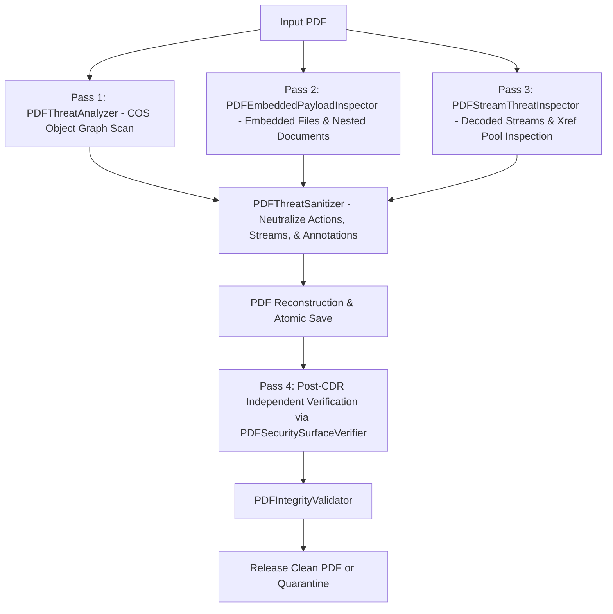

# PDF Threat Analysis Subsystem (`threat.pdf`)

## Overview

The `threat.pdf` package implements a comprehensive, multi-pass security analysis subsystem for **Portable Document Format (PDF)** documents.

PDF is an inherently complex format supporting interactive JavaScript, executable launch actions, embedded file payloads, active XML forms (XFA), multimedia/3D objects, and raw compressed object streams. DocShield implements a **layered, object-graph and byte-level defense** to inspect and disarm these vectors without executing untrusted content.

---

## Layered PDF Security Architecture

---

## Core Classes & Responsibilities

### 1. [`PDFThreatAnalyzer`](file:///D:/CAIR/DOC%20SHIELD/DocShield/cdr/src/main/java/threat/pdf/PDFThreatAnalyzer.java)
- **Path**: `src/main/java/threat/pdf/PDFThreatAnalyzer.java`
- **Responsibilities**:
  - Traverses the PDF COS object graph starting from the Document Catalog and all Page objects down to a maximum depth of `MAX_COS_GRAPH_DEPTH = 256` and budget of `MAX_COS_OBJECTS = 200,000`.
  - **Blocking Actions**: Identifies `/JavaScript`, `/Launch`, `/GoToR`, `/GoToE`, `/SubmitForm`, `/ImportData`, `/Rendition`, `/Movie`, `/Sound`, and `/RichMediaExecute`.
  - **Direct JavaScript**: Detects `/JS` and `/JavaScript` dictionary entries.
  - **Active Subtypes & Annotations**: Flags `/FileAttachment`, `/RichMedia`, `/3D`, `/Movie`, `/Sound`, and `/Screen`.
  - **Embedded Files**: Flags `/Filespec`, `/EF`, `/EmbeddedFiles`, and `/AF` entries.
  - **Forms & Signatures**: Flags active `/XFA` forms and `/Sig` digital signatures (which cannot remain valid across reconstruction).
  - **URI Validation**: Normalizes and audits `/URI` actions against dangerous schemes (`file:`, `javascript:`, `vbscript:`, `data:`, `shell:`, `mk:`, `acrobat:`, `ms-*`).

---

### 2. [`PDFEmbeddedPayloadInspector`](file:///D:/CAIR/DOC%20SHIELD/DocShield/cdr/src/main/java/threat/pdf/PDFEmbeddedPayloadInspector.java)
- **Path**: `src/main/java/threat/pdf/PDFEmbeddedPayloadInspector.java`
- **Responsibilities**:
  - Locates all embedded file streams inside `/Filespec/EF` dictionaries.
  - Limits payload size to `MAX_EMBEDDED_PAYLOAD_BYTES = 64 MB` and count to `MAX_EMBEDDED_PAYLOADS = 256`.
  - Detects nested format:
    - If nested **PDF**: runs `PDFThreatAnalyzer` recursively.
    - If nested **DOCX / PPTX / XLSX**: reads package via `OOXMLPackageReader` and executes format-specific threat analyzer.
    - If nested format is unknown/unsupported: issues `UNSUPPORTED_CONTENT` finding (**fail-closed**).

---

### 3. [`PDFStreamThreatInspector`](file:///D:/CAIR/DOC%20SHIELD/DocShield/cdr/src/main/java/threat/pdf/PDFStreamThreatInspector.java)
- **Path**: `src/main/java/threat/pdf/PDFStreamThreatInspector.java`
- **Responsibilities**:
  - Inspects decoded stream bytes across the document catalog, page tree, and **the entire xref object table pool** (`cosDocument.getXrefTable()`).
  - Detects high-confidence binary executable signatures:
    - **PE Executable**: Requires `MZ` header + 4-byte `PE\0\0` signature at DWORD `e_lfanew` offset `0x3C`.
    - **ELF Executable**: Starts with `\x7fELF`.
    - **Mach-O Executable**: Magic numbers `0xFEEDFACE`, `0xFEEDFACF`, `0xCEFAEDFE`, `0xCFFAEDFE`, `0xCAFEBABE`, `0xBEBAFECA`.
    - **Executable Scripts**: Shebangs (`#!`) targeting `/sh`, `/bash`, `/python`, `/perl`, `powershell`, `wscript`, `cscript`.
    - **EICAR Test Signature**: Contiguous antivirus test string.
  - **Fail-Closed Stream Decoding**: If a stream cannot be decompressed or decoded (e.g. malformed or unsupported filter), flags `UNSUPPORTED_CONTENT` or `PDF_RESOURCE_LIMIT` as a **CRITICAL THREAT**, preventing false-safe escapes.

---

### 4. [`PDFSecuritySurfaceVerifier`](file:///D:/CAIR/DOC%20SHIELD/DocShield/cdr/src/main/java/threat/pdf/PDFSecuritySurfaceVerifier.java)
- **Path**: `src/main/java/threat/pdf/PDFSecuritySurfaceVerifier.java`
- **Responsibilities**:
  - Independent post-reconstruction verifier that re-parses the newly written PDF.
  - Operates independently of `PDFThreatAnalyzer` to verify core post-CDR invariants:
    - Confirms zero prohibited active dictionary keys (`JavaScript`, `JS`, `AA`, `OpenAction`, `RichMedia`, `3D`, `XFA`, `AF`, `EmbeddedFiles`) exist in the catalog, pages, or xref pool.
    - Re-scans all reconstructed stream bytes to guarantee no executable payloads survived.

---

### 5. [`PDFSecurityPolicy`](file:///D:/CAIR/DOC%20SHIELD/DocShield/cdr/src/main/java/threat/pdf/PDFSecurityPolicy.java)
- **Path**: `src/main/java/threat/pdf/PDFSecurityPolicy.java`
- **Constants**:
  - `MAX_INPUT_BYTES = 200 MB`
  - `MAX_EMBEDDED_PAYLOAD_BYTES = 64 MB`
  - `MAX_EMBEDDED_PAYLOADS = 256`
  - `MAX_COS_OBJECTS = 200,000`
  - `MAX_PAGES = 10,000`
  - `MAX_URI_DECODE_ROUNDS = 3`
  - `MAX_COS_GRAPH_DEPTH = 256`

---

## Threat Detection Coverage Table

| Threat / Capability | Detection Class | Evidence Checked | Classification & Severity | Blocking? | Sanitized? |
|---|---|---|---|---|---|
| **PDF JavaScript Action** | `PDFThreatAnalyzer` | `/S /JavaScript` action dictionary or `/JS` entry | `THREAT` / `CRITICAL` | **YES** | **YES** (action / entry removed) |
| **PDF Active Launch Action** | `PDFThreatAnalyzer` | `/S /Launch` action dictionary | `THREAT` / `CRITICAL` | **YES** | **YES** (action removed) |
| **PDF Remote Navigation Action** | `PDFThreatAnalyzer` | `/S /GoToR`, `/S /GoToE` action dictionary | `THREAT` / `CRITICAL` | **YES** | **YES** (action removed) |
| **PDF Form Submission / Import** | `PDFThreatAnalyzer` | `/S /SubmitForm`, `/S /ImportData` action dictionary | `THREAT` / `CRITICAL` | **YES** | **YES** (action removed) |
| **PDF Media / Rendition Action** | `PDFThreatAnalyzer` | `/S /Rendition`, `/S /Movie`, `/S /Sound`, `/S /RichMediaExecute` | `THREAT` / `CRITICAL` | **YES** | **YES** (action removed) |
| **Dangerous URI Scheme** | `PDFThreatAnalyzer` | `file:`, `javascript:`, `vbscript:`, `data:`, `shell:`, `mk:`, `ms-*` | `THREAT` / `CRITICAL` | **YES** | **YES** (URI action disarmed) |
| **Active Annotation Subtype** | `PDFThreatAnalyzer` | `/Subtype /FileAttachment`, `/RichMedia`, `/3D`, `/Movie`, `/Sound`, `/Screen` | `THREAT` / `HIGH` | **YES** | **YES** (annotation removed from page) |
| **PDF File Specification / EF** | `PDFThreatAnalyzer` | `/Type /Filespec`, `/EF`, `/EmbeddedFiles`, `/AF` | `THREAT` / `HIGH` | **YES** | **YES** (Filespec EF removed, name tree removed) |
| **XFA Form Content** | `PDFThreatAnalyzer` | `/XFA` dictionary entry in catalog or AcroForm | `THREAT` / `HIGH` | **YES** | **YES** (XFA removed; AcroForm retained) |
| **PDF Digital Signature** | `PDFThreatAnalyzer` | `/FT /Sig`, `/Type /Sig` | `POLICY_VIOLATION` / `MEDIUM` | **YES** | **YES** (signature fields & byte ranges removed) |
| **Encrypted PDF Document** | `PDFThreatAnalyzer` | `document.isEncrypted()` | `POLICY_VIOLATION` / `MEDIUM` | **YES** | **YES** (reconstructed without encryption) |
| **PE Executable in Stream** | `PDFStreamThreatInspector` | `MZ` header with valid `PE\0\0` at `e_lfanew` in decoded stream | `THREAT` / `CRITICAL` | **YES** | **YES** (stream contents truncated/neutralized) |
| **ELF / Mach-O / Shebang** | `PDFStreamThreatInspector` | Executable magic numbers in decoded stream | `THREAT` / `CRITICAL` | **YES** | **YES** (stream contents truncated/neutralized) |
| **EICAR Test Signature** | `PDFStreamThreatInspector` | EICAR test marker inside decoded stream | `THREAT` / `CRITICAL` | **YES** | **YES** (stream neutralized) |
| **Undecodable / Corrupt Stream** | `PDFStreamThreatInspector` | Stream decompression/decoding failure | `UNSUPPORTED_CONTENT` / `CRITICAL` | **YES** | **Fail-Closed (Quarantined)** |
| **Object Traversal Limit Exceeded** | `PDFThreatAnalyzer` | Graph depth > 256 or object count > 200,000 | `PDF_RESOURCE_LIMIT` / `CRITICAL` | **YES** | **Fail-Closed (Quarantined)** |
| **Ordinary Web / Mail Hyperlink** | `PDFThreatAnalyzer` | Valid external HTTP/HTTPS/mailto URI | `OBSERVATION` / `INFO` | **NO** | **Preserved unchanged** |
